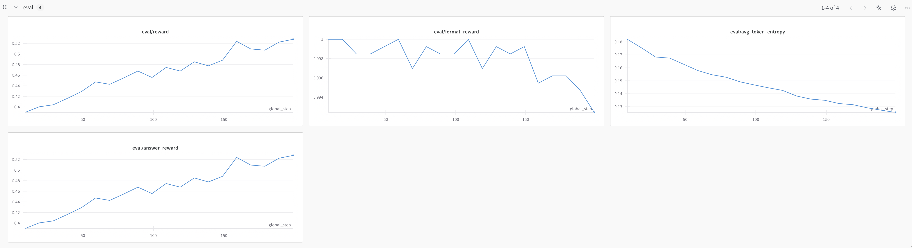
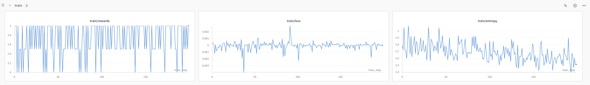

# RL Overview

The assignment instruction said that we don't need to do cold start from sft. However, from my test, if testing on gsm8k, without sft, the initial reward is only 0.02. This means it's very hard for rl to start because rl (especially grpo) relies on at least one correct answer to have positive reward. otherwise mean reward is 0 and loss is always 0 so nothing can be learnt.

As a result, we have to use sft to do cold start. From sft, the final eval reward is 0.35, we trained 3 epochs.

## Baseline

```
advantage_eps:0.000001
clip_range:0.2
epochs_per_rollout_batch:1
eval_steps:10
gradient_accumulation_steps:128
group_size:8
learning_rate:0.00001
loss_type:"reinforce_with_baseline"
model_name:"sft_model"
n_grpo_steps:200
output_dir:"outputs"
prompt_path:"cs336_alignment/prompts/r1_zero.prompt"
rollout_batch_size:256
sampling_max_tokens:1,024
sampling_min_tokens:4
sampling_temperature:1
train_batch_size:256
use_std_normalization:true
```

Final reward goes up to 0.52 (I'm not sure if it's saturated or not). Compared to sft result 0.35, it's huge improvement. This means our rl implementation actually helps with model performance. 

Below is eval graph, you can see reward keeps going up and eval token entropy keeps going down.



For training reward, I actually cannot reason with it.  I cannot find a pattern.

