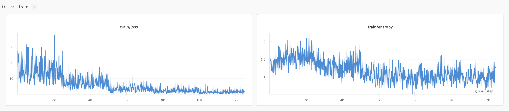
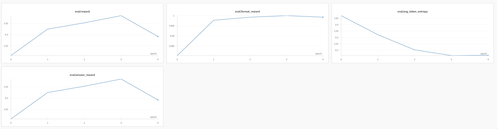

# SFT Report

## Config

* Dataset: gsm8k
* Batch size: 3
* Gradient accumulation: 4
* Learning rate: 1e-4 (Might be too large for small model and small dataset)

## Training Metrics

Observations

* Loss is spiky, but you can see at each epoch, loss is actually dropping
* Token entropy does not show a strong pattern, looks like it's dropping?

## Eval Metrics

Observations

* At epoch 4 it reaches best, then start dropping. This indicates at with more epochs, model starts to overfit. It seems pretty common, for small model and small dataset, it hurts to add more training epochs

* Original model only has mean reward 0.02, so it's actually huge improvement. It indicates that sft is actually working.